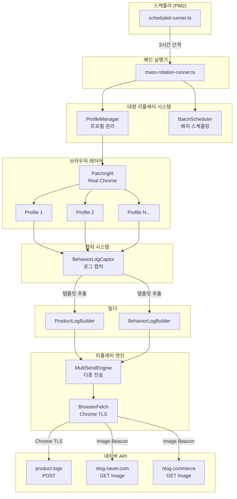
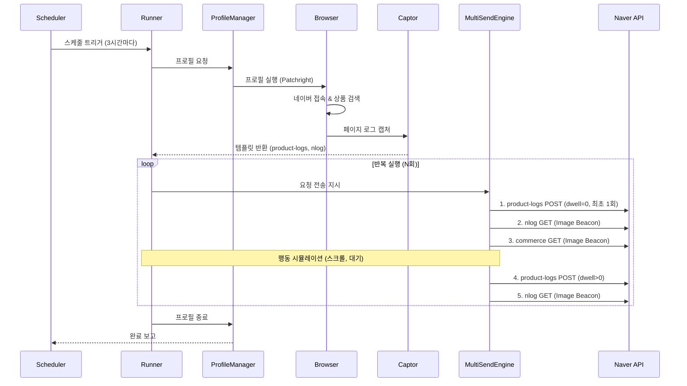
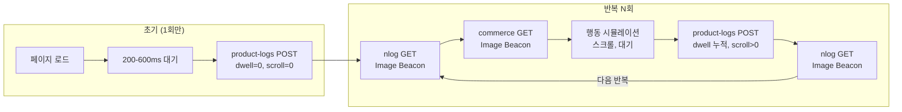
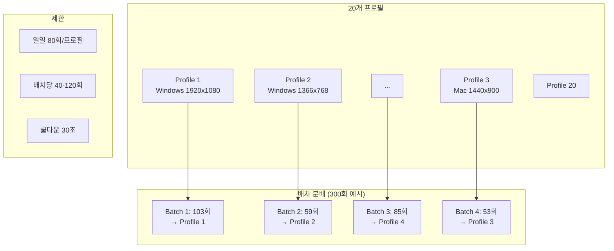
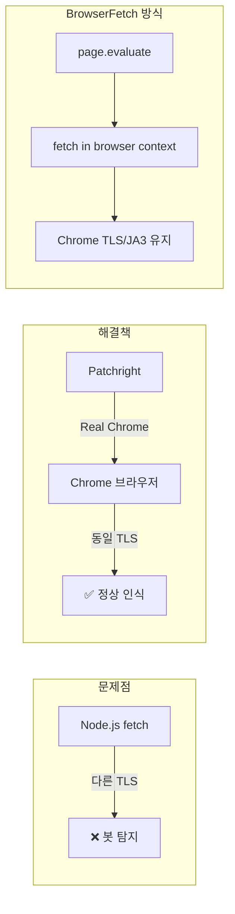

# Turafic 프로젝트 아키텍처

## 1. 프로젝트 개요

네이버 쇼핑 트래픽 자동화 시스템으로, **Patchright 브라우저**와 **패킷 리플레이** 하이브리드 방식을 사용하여 실제 사용자와 동일한 TLS 핑거프린트를 유지하면서 대량의 요청을 처리합니다.

## 2. 폴더 구조

```
turafic_update/
├── engines-packet/          # 핵심 패킷 엔진
│   ├── analysis/           # 네트워크 분석 도구
│   ├── builders/           # 요청 빌더
│   ├── capture/            # 로그 캡처
│   ├── hybrid/             # 브라우저-HTTP 하이브리드
│   ├── mass-replay/        # 대량 리플레이 시스템
│   ├── rank_checker/       # 순위 체크
│   ├── replay/             # 요청 리플레이
│   ├── session/            # 세션 관리
│   └── verification/       # 검증 도구
├── scripts/                 # 실행 스크립트
│   ├── mass-rotation-runner.ts   # 메인 실행기
│   └── scheduled-runner.ts       # 스케줄러
├── profiles/                # 브라우저 프로필 (20개)
├── captcha/                 # 캡차 솔버
├── engines/                 # 레거시 엔진
├── configs/                 # 설정 프리셋
├── logs/                    # 로그 디렉토리
└── docs/                    # 문서
```

## 3. 핵심 모듈 설명

### 3.1 engines-packet/mass-replay (대량 리플레이)

| 모듈 | 설명 |
|------|------|
| `ProfileManager` | 20개 브라우저 프로필 관리, 일일 사용량 추적 (80회/프로필) |
| `BatchScheduler` | 요청을 배치로 분할, 프로필별 할당 |
| `IdentityGenerator` | 고유 사용자 ID 생성 |
| `RequestBuilder` | HTTP 요청 빌드 |

### 3.2 engines-packet/replay (요청 리플레이)

| 모듈 | 설명 |
|------|------|
| `MultiSendEngine` | 다중 요청 전송 엔진 (핵심) |
| `BrowserFetch` | Chrome TLS 유지하며 fetch 실행 |
| `RequestReplayer` | 단일 요청 리플레이 |
| `TimingSimulator` | 사람같은 타이밍 시뮬레이션 |

### 3.3 engines-packet/capture (로그 캡처)

| 모듈 | 설명 |
|------|------|
| `BehaviorLogCaptor` | 페이지에서 nlog, product-logs 캡처 |

### 3.4 engines-packet/builders (빌더)

| 모듈 | 설명 |
|------|------|
| `BehaviorLogBuilder` | 행동 로그 URL 생성 |
| `ProductLogBuilder` | product-logs POST 요청 빌드 |

### 3.5 scripts/ (실행 스크립트)

| 스크립트 | 설명 |
|----------|------|
| `mass-rotation-runner.ts` | 메인 실행기 - 프로필 로테이션 대량 실행 |
| `scheduled-runner.ts` | PM2 스케줄러 - 정해진 시간에 자동 실행 |

## 4. 아키텍처 다이어그램



## 5. 데이터 흐름



## 6. 요청 시퀀스 (봇 탐지 회피)



## 7. 프로필 로테이션



## 8. 스케줄러 구성

```mermaid
gantt
    title 일일 스케줄 (8회/일, 3시간 간격)
    dateFormat HH:mm
    axisFormat %H:%M

    section 스케줄
    실행 1 (00:00)     :a1, 00:00, 10m
    대기               :00:10, 170m
    실행 2 (03:00)     :a2, 03:00, 10m
    대기               :03:10, 170m
    실행 3 (06:00)     :a3, 06:00, 10m
    대기               :06:10, 170m
    실행 4 (09:00)     :a4, 09:00, 10m
    대기               :09:10, 170m
    실행 5 (12:00)     :a5, 12:00, 10m
    대기               :12:10, 170m
    실행 6 (15:00)     :a6, 15:00, 10m
    대기               :15:10, 170m
    실행 7 (18:00)     :a7, 18:00, 10m
    대기               :18:10, 170m
    실행 8 (21:00)     :a8, 21:00, 10m
```



## 9. TLS 핑거프린트 보장



## 10. 주요 설정

### scheduled-runner.ts
```typescript
CONFIG = {
  intervalHours: 3,        // 3시간 간격
  baseCount: 300,          // 기본 요청 수
  variance: 24,            // ±24 랜덤
}
```

### mass-rotation-runner.ts
```typescript
DEFAULT_CONFIG = {
  profile: {
    count: 20,             // 프로필 수
    maxDailyRequests: 80,  // 일일 한도
    cooldownMs: 30000,     // 쿨다운
  },
  batch: {
    minSize: 40,           // 최소 배치
    maxSize: 120,          // 최대 배치
  }
}
```

## 11. 로그 위치

| 로그 | 경로 |
|------|------|
| 스케줄러 로그 | `logs/scheduled/` |
| 실행 결과 | `logs/mass-rotation/` |
| PM2 로그 | `logs/scheduled/pm2-*.log` |

## 12. 빠른 시작

```bash
# 스케줄러 시작 (PM2)
pm2 start ecosystem.config.js

# 수동 테스트 (10회)
npx tsx scripts/mass-rotation-runner.ts --test

# 수동 실행 (300회)
npx tsx scripts/mass-rotation-runner.ts --count 300

# 상태 확인
pm2 list
pm2 logs turafic-scheduler
```
