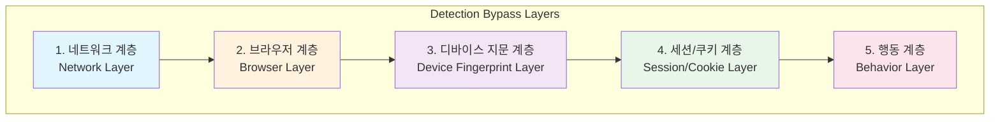
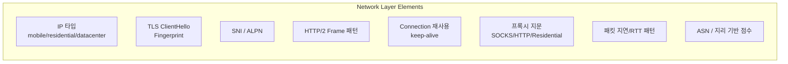
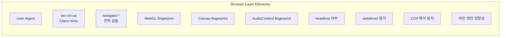
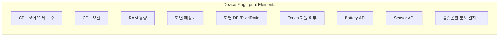
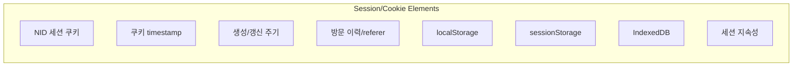
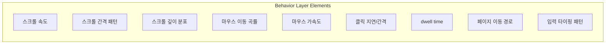
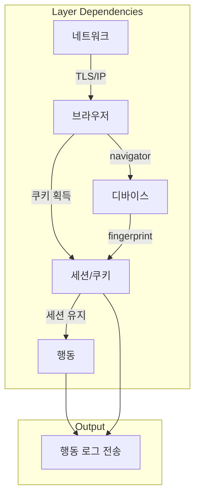

# Packet Engine Architecture

> 네이버 트래픽 탐지 우회를 위한 5계층 구조

## Overview



---

## 1. 네트워크 계층 (Network Layer)

> IP, TLS, 연결 패턴 관련 탐지 요소



### 체크리스트

| 요소 | 설명 | 탐지 위험도 | 대응 방안 |
|------|------|------------|----------|
| IP 타입 | mobile > residential > datacenter 순 신뢰도 | 🔴 높음 | 모바일 테더링 사용 |
| TLS ClientHello | JA3/JA4 fingerprint | 🔴 높음 | Chrome TLS 사용 (BrowserFetch) |
| SNI/ALPN | TLS 확장 필드 | 🟡 중간 | 브라우저 기본값 유지 |
| HTTP/2 Frame | SETTINGS, WINDOW_UPDATE 패턴 | 🟡 중간 | Chrome 기본 패턴 |
| Connection 재사용 | keep-alive 패턴 | 🟢 낮음 | 자연스러운 재사용 |
| 프록시 지문 | X-Forwarded-For 등 | 🔴 높음 | 직접 연결 또는 Residential |
| RTT 패턴 | 네트워크 지연 일관성 | 🟡 중간 | IP 로테이션 주기 조절 |
| ASN/지리 | IP 평판, 위치 | 🟡 중간 | 국내 IP 사용 |

### 관련 파일

```
engines-packet/
├── replay/BrowserFetch.ts      # Chrome TLS 보장
├── verification/TLSVerifier.ts # TLS 검증
└── session/HeaderBuilder.ts    # HTTP/2 헤더
```

---

## 2. 브라우저 계층 (Browser Layer)

> 브라우저 식별 및 자동화 탐지 요소



### 체크리스트

| 요소 | 설명 | 탐지 위험도 | 대응 방안 |
|------|------|------------|----------|
| User-Agent | 브라우저 식별 문자열 | 🟡 중간 | 최신 Chrome UA |
| sec-ch-ua | Client Hints 헤더 | 🔴 높음 | 정확한 버전 일치 필수 |
| navigator.* | platform, hardwareConcurrency 등 | 🟡 중간 | 실제 값 사용 |
| WebGL | GPU 렌더링 fingerprint | 🟢 낮음 | 실제 GPU 사용 |
| Canvas | 2D 렌더링 fingerprint | 🟢 낮음 | 실제 렌더링 |
| AudioContext | 오디오 처리 fingerprint | 🟢 낮음 | 기본값 |
| headless | Headless 모드 탐지 | 🔴 높음 | headless: false |
| webdriver | navigator.webdriver | 🔴 높음 | Patchright/PRB 패치 |
| CDP | DevTools Protocol 탐지 | 🔴 높음 | Patchright/PRB 패치 |
| 버전 정합성 | UA ↔ sec-ch-ua 일치 | 🔴 높음 | 자동 생성 |

### 관련 파일

```
engines-packet/
├── session/HeaderBuilder.ts       # Client Hints 생성
├── session/DeviceIdGenerator.ts   # 디바이스 ID
└── hybrid/HybridContext.ts        # 브라우저 컨텍스트
```

### PRB vs Patchright 차이

| 기능 | PRB | Patchright | 비고 |
|------|-----|------------|------|
| webdriver 패치 | ✅ | ✅ | 동일 |
| CDP 탐지 우회 | ✅ | ✅ | 동일 |
| realCursor | ✅ | ❌ | PRB만 지원 |
| ghost-cursor | ✅ 내장 | ❌ 별도 | PRB 우위 |
| Turnstile 우회 | ✅ | ❌ | PRB만 지원 |
| 안정성 | 🟡 | ✅ | Patchright 우위 |

---

## 3. 디바이스 지문(Entropy) 계층

> 하드웨어/환경 기반 fingerprint 요소



### 체크리스트

| 요소 | 설명 | 탐지 위험도 | 대응 방안 |
|------|------|------------|----------|
| CPU 코어 | hardwareConcurrency | 🟢 낮음 | 실제 값 (4~16) |
| GPU 모델 | WebGL RENDERER | 🟢 낮음 | 실제 GPU |
| RAM | deviceMemory | 🟢 낮음 | 실제 값 (4~32GB) |
| 해상도 | screen.width/height | 🟡 중간 | 일반적 해상도 |
| DPI | devicePixelRatio | 🟡 중간 | 1 또는 1.25 |
| Touch | maxTouchPoints | 🟢 낮음 | 0 (데스크톱) |
| Battery | getBattery() | 🟢 낮음 | 미지원 또는 실제값 |
| Sensor | DeviceMotion 등 | 🟢 낮음 | 미지원 (데스크톱) |
| 분포 일치도 | 전형적 조합 여부 | 🟡 중간 | 일반적 조합 유지 |

### 관련 파일

```
engines-packet/
├── session/DeviceIdGenerator.ts  # 디바이스 ID 생성
└── types.ts                      # ClientHintsConfig
```

---

## 4. 세션/쿠키 계층 (Session/Cookie Layer)

> 세션 지속성 및 쿠키 패턴 관련 요소



### 체크리스트

| 요소 | 설명 | 탐지 위험도 | 대응 방안 |
|------|------|------------|----------|
| NID 쿠키 | 네이버 세션 쿠키 | 🔴 높음 | 브라우저에서 획득 |
| 쿠키 timestamp | 생성 시간 일관성 | 🟡 중간 | 자연스러운 흐름 |
| 생성/갱신 주기 | 쿠키 라이프사이클 | 🟡 중간 | 실제 패턴 모방 |
| referer 흐름 | 페이지 이동 경로 | 🔴 높음 | 정상 경로 유지 |
| localStorage | 클라이언트 저장소 | 🟢 낮음 | 브라우저 동기화 |
| sessionStorage | 세션 저장소 | 🟢 낮음 | 브라우저 동기화 |
| IndexedDB | 구조화 저장소 | 🟢 낮음 | 브라우저 동기화 |
| 세션 지속성 | 연속 접속 기록 | 🟡 중간 | 프로필 재사용 |

### 관련 파일

```
engines-packet/
├── session/SessionManager.ts      # 세션 상태 관리
├── session/CookieExtractor.ts     # 쿠키 추출/파싱
├── hybrid/BrowserSync.ts          # 브라우저 동기화
└── verification/CookieChainVerifier.ts
```

---

## 5. 행동 계층 (Behavior Layer)

> 사용자 행동 패턴 관련 요소



### 체크리스트

| 요소 | 설명 | 탐지 위험도 | 대응 방안 |
|------|------|------------|----------|
| 스크롤 속도 | wheel deltaY 크기 | 🟡 중간 | 100~250px 랜덤 |
| 스크롤 간격 | 스크롤 이벤트 간격 | 🟡 중간 | 80~140ms 랜덤 |
| 스크롤 깊이 | 최종 스크롤 위치 | 🟡 중간 | 상품까지 스크롤 |
| 마우스 곡률 | 베지어 곡선 | 🔴 높음 | cubicBezier 사용 |
| 마우스 가속도 | easing 패턴 | 🟡 중간 | easeInOutQuad |
| 클릭 지연 | mousedown~up 간격 | 🟡 중간 | 30~80ms |
| dwell time | 페이지 체류 시간 | 🔴 높음 | 1~3초 랜덤 |
| 페이지 경로 | 검색→상품 흐름 | 🔴 높음 | 정상 경로 유지 |
| 타이핑 패턴 | keydown 간격 | 🟡 중간 | 30~60ms 랜덤 |

### 관련 파일

```
engines-packet/
├── builders/BehaviorLogBuilder.ts  # 행동 로그 생성
├── builders/ProductLogBuilder.ts   # 상품 로그 생성
├── replay/TimingSimulator.ts       # 타이밍 시뮬레이션
└── capture/BehaviorLogCaptor.ts    # 행동 캡처
```

---

## 계층 간 의존성



---

## 실행 환경별 차이

### Production (unified-runner.ts)

```
추가 모듈:
- IP Rotation (ipRotation.ts)
- CAPTCHA Solver (ReceiptCaptchaSolverPRB.ts)
- 병렬 브라우저 (PARALLEL_BROWSERS = 4)
- 브라우저 지연 (BROWSER_LAUNCH_DELAY = 3000ms)
```

### Test 환경

```
제외 모듈:
- IP Rotation ❌
- CAPTCHA Solver ❌
- 병렬 브라우저 ❌ (단일 실행)
- 브라우저 지연 ❌

동일 모듈:
- 5계층 탐지 우회 로직 ✅
- 세션 관리 ✅
- 행동 시뮬레이션 ✅
```

---

## Version History

| 날짜 | 버전 | 변경사항 |
|------|------|---------|
| 2024-12-11 | v1.0 | 초기 문서 작성 |
