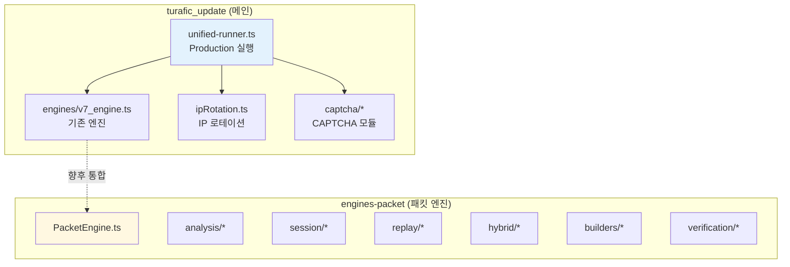
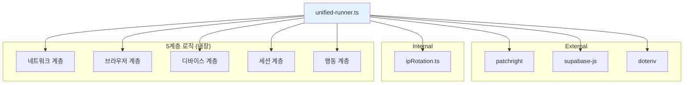
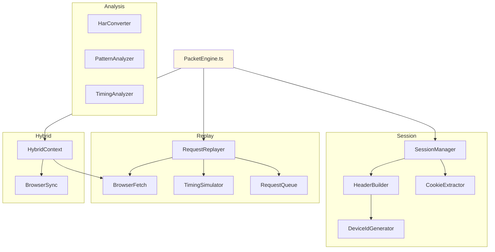
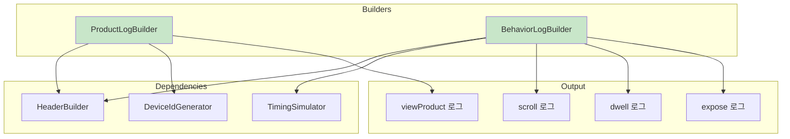
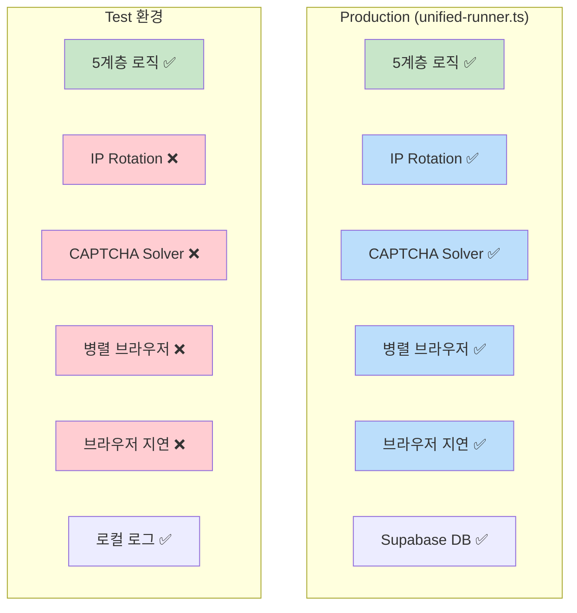
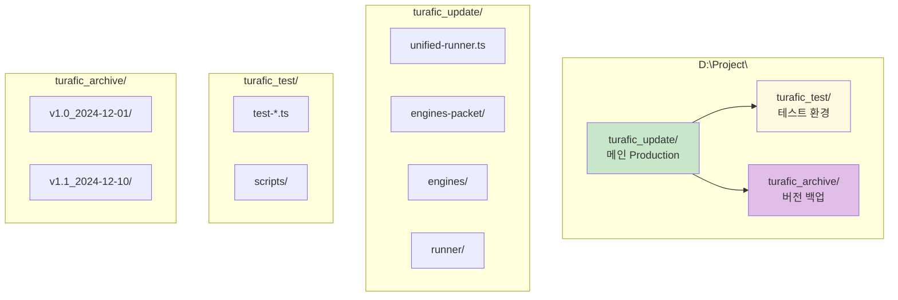

# Dependencies & File Structure

> 파일 의존성 및 폴더 구조 가이드

## 프로젝트 폴더 구조



---

## 파일별 의존성 맵

### 1. unified-runner.ts (Production)



### 2. PacketEngine.ts



### 3. 행동 로그 빌더



---

## Production vs Test 환경



### 공유 vs 분리 모듈

| 모듈 | Production | Test | 비고 |
|------|------------|------|------|
| 5계층 로직 | ✅ | ✅ | **동일해야 함** |
| 베지어 마우스 | ✅ | ✅ | **동일해야 함** |
| 인간화 타이핑 | ✅ | ✅ | **동일해야 함** |
| 헤더 생성 | ✅ | ✅ | **동일해야 함** |
| IP Rotation | ✅ | ❌ | Production만 |
| CAPTCHA Solver | ✅ | ❌ | Production만 |
| 병렬 브라우저 | ✅ | ❌ | Production만 |
| Supabase | ✅ | ❌ | Production만 |

---

## 폴더 정리 방안

### 현재 구조

```
D:\Project\
├── turafic_update/      # 메인 (Production)
├── patch-right/         # Patchright 테스트
└── navertrafic/         # 이전 버전 (deprecated?)
```

### 권장 구조



### 폴더별 역할

| 폴더 | 역할 | Git 관리 |
|------|------|----------|
| `turafic_update/` | Production 코드 | ✅ main 브랜치 |
| `turafic_test/` | 테스트 코드 | ✅ test 브랜치 |
| `turafic_archive/` | 버전 백업 | ❌ 로컬만 |
| `patch-right/` | 폐기 또는 통합 | ❌ |
| `navertrafic/` | 폐기 | ❌ |

---

## Import 구조

### engines-packet 내부

```typescript
// PacketEngine.ts
import { HybridContext } from "./hybrid/HybridContext";
import { SessionManager } from "./session/SessionManager";
import { RequestReplayer } from "./replay/RequestReplayer";

// HybridContext.ts
import { BrowserSync } from "./BrowserSync";
import { BrowserFetch } from "../replay/BrowserFetch";

// SessionManager.ts
import { CookieExtractor } from "./CookieExtractor";
import { HeaderBuilder } from "./HeaderBuilder";

// HeaderBuilder.ts
import { DeviceIdGenerator } from "./DeviceIdGenerator";
```

### 외부에서 사용

```typescript
// unified-runner.ts 또는 test 파일
import {
  PacketEngine,
  ProductLogBuilder,
  BehaviorLogBuilder,
  BrowserFetch,
} from "./engines-packet";
```

---

## 변경 추적 가이드

### Git 커밋 메시지 규칙

```
[계층] 변경내용

예시:
[L1-Network] TLS fingerprint 검증 추가
[L2-Browser] Client Hints 버전 업데이트
[L3-Device] deviceMemory 값 조정
[L4-Session] 쿠키 만료 처리 개선
[L5-Behavior] 스크롤 패턴 수정
[Hybrid] BrowserFetch 타임아웃 조정
[Test] viewProduct 테스트 추가
```

### 변경 영향도 체크리스트

```
□ L1 변경 → TLS/IP 관련 테스트 필요
□ L2 변경 → 브라우저 탐지 테스트 필요
□ L3 변경 → fingerprint 일관성 확인
□ L4 변경 → 세션 유지 테스트 필요
□ L5 변경 → 행동 패턴 테스트 필요
□ Hybrid 변경 → 전체 플로우 테스트
```

---

## Version History

| 날짜 | 버전 | 변경사항 |
|------|------|---------|
| 2024-12-11 | v1.0 | 초기 문서 작성 |
