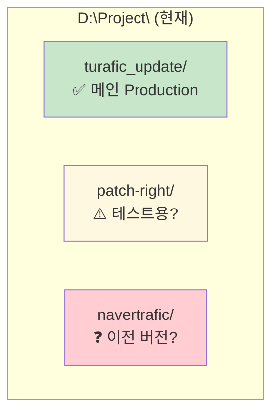
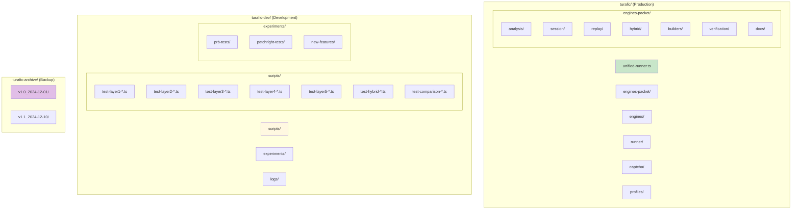
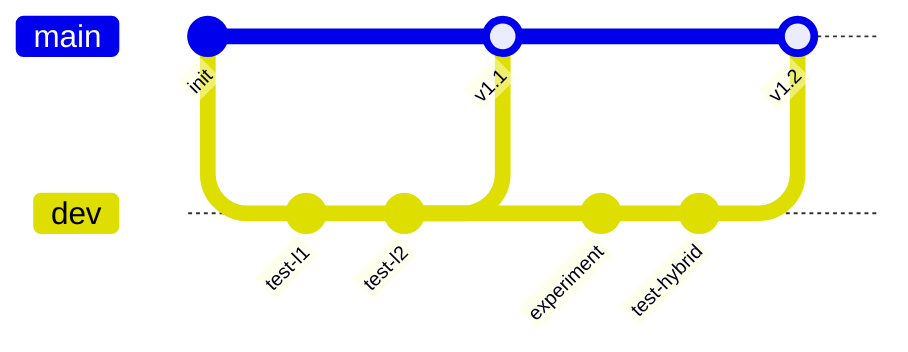
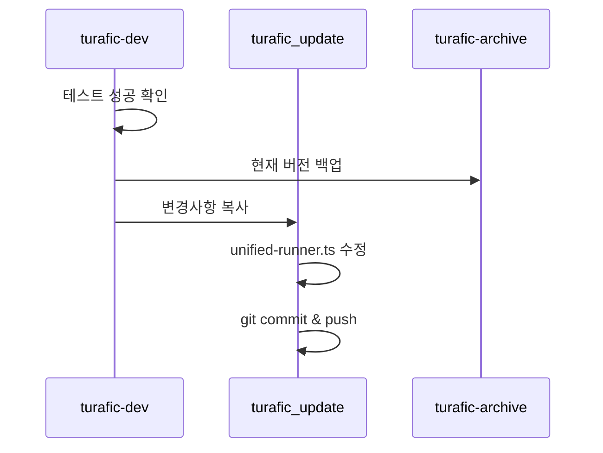

# Folder Structure & Organization Guide

> 폴더 구조 정리 및 관리 가이드

## 현재 상태 분석



### 문제점

1. **폴더 역할 불명확** - patch-right, navertrafic 용도 불분명
2. **테스트 코드 산재** - 여러 폴더에 테스트 파일 분산
3. **버전 관리 부재** - 백업/롤백 체계 없음
4. **환경 분리 안됨** - Production/Test 코드 혼재

---

## 권장 폴더 구조

### 최상위 구조

```
D:\Project\
├── turafic/                    # Production (배포용)
│   ├── unified-runner.ts       # 메인 실행 파일
│   ├── engines/                # 기존 엔진
│   ├── engines-packet/         # 패킷 엔진
│   ├── runner/                 # 러너 공통
│   ├── captcha/                # CAPTCHA 모듈
│   ├── profiles/               # 프로필
│   └── .env                    # 환경변수
│
├── turafic-dev/                # Development (개발용)
│   ├── scripts/                # 테스트 스크립트
│   ├── experiments/            # 실험 코드
│   └── logs/                   # 테스트 로그
│
├── turafic-archive/            # Archive (백업용)
│   ├── v1.0_2024-12-01/
│   ├── v1.1_2024-12-10/
│   └── v1.2_2024-12-11/
│
└── [폐기 예정]
    ├── patch-right/            # → turafic-dev로 통합
    └── navertrafic/            # → 삭제 또는 archive
```

### 상세 구조



---

## 폴더별 역할

### 1. turafic/ (Production)

| 폴더/파일 | 역할 | Git 브랜치 |
|----------|------|-----------|
| `unified-runner.ts` | Production 메인 실행 | main |
| `engines/` | 기존 v7 엔진 | main |
| `engines-packet/` | 패킷 엔진 모듈 | main |
| `runner/` | 공통 타입/유틸 | main |
| `captcha/` | CAPTCHA 해결 모듈 | main |
| `profiles/` | 브라우저 프로필 | main |
| `ipRotation.ts` | IP 로테이션 | main |

### 2. turafic-dev/ (Development)

| 폴더 | 역할 | Git 브랜치 |
|------|------|-----------|
| `scripts/` | 계층별 테스트 스크립트 | dev |
| `experiments/` | 실험적 코드 | dev |
| `logs/` | 테스트 결과 로그 | .gitignore |

### 3. turafic-archive/ (Backup)

| 폴더 | 역할 | Git 관리 |
|------|------|----------|
| `v*_YYYY-MM-DD/` | 버전별 스냅샷 | ❌ 로컬만 |

---

## 마이그레이션 계획

### Phase 1: 현재 구조 정리

```bash
# 1. turafic_update → turafic 이름 변경 (또는 유지)
# 현재 turafic_update가 메인이므로 그대로 사용 가능

# 2. 테스트 파일 분리
mkdir -p D:/Project/turafic-dev/scripts
mkdir -p D:/Project/turafic-dev/experiments
mkdir -p D:/Project/turafic-dev/logs

# 3. scripts/ 폴더의 테스트 파일 이동
mv D:/Project/turafic_update/scripts/test-*.ts D:/Project/turafic-dev/scripts/
```

### Phase 2: 백업 체계 구축

```bash
# 버전 백업 폴더 생성
mkdir -p D:/Project/turafic-archive

# 현재 버전 백업
DATE=$(date +%Y-%m-%d)
VERSION="v1.2"
cp -r D:/Project/turafic_update D:/Project/turafic-archive/${VERSION}_${DATE}
```

### Phase 3: 불필요 폴더 정리

```bash
# patch-right 폴더 확인 후 처리
# - 유용한 코드 → turafic-dev/experiments/로 이동
# - 나머지 → 삭제

# navertrafic 폴더 확인 후 처리
# - 이전 버전이면 archive로 이동
# - 불필요하면 삭제
```

---

## Git 브랜치 전략



### 브랜치 규칙

| 브랜치 | 용도 | 머지 대상 |
|--------|------|----------|
| `main` | Production 코드 | - |
| `dev` | 개발/테스트 | → main |
| `feature/*` | 신기능 개발 | → dev |
| `hotfix/*` | 긴급 수정 | → main |

---

## 파일 동기화 규칙

### Production ← Test 반영 시



### 반영 체크리스트

```
□ 테스트 환경에서 모든 계층 통과
□ PRB/Patchright 비교 완료
□ 현재 Production 버전 백업
□ 변경된 계층 명시
□ unified-runner.ts 주석 업데이트
□ 커밋 메시지에 [L1-L5] 태그
□ git push 후 런처에서 자동 업데이트 확인
```

---

## unified-runner.ts 구조 규칙

Production 코드에서 5계층을 명확히 구분:

```typescript
// ============================================================
//  탐지 우회 계층 구조 (Detection Bypass Layers)
// ============================================================
//
//  ┌─────────────────────────────────────────────────────────────┐
//  │  1. 네트워크 계층 (Network Layer)                           │
//  │     - IP 로테이션 (ipRotation.ts)                           │
//  │     - 외부 IP 확인, 테더링 어댑터 관리                       │
//  ├─────────────────────────────────────────────────────────────┤
//  │  2. 브라우저 계층 (Browser Layer)                           │
//  │     - Patchright (Playwright fork, 봇 탐지 우회)            │
//  │     - 브라우저 창 위치/크기, 멀티 인스턴스                   │
//  ├─────────────────────────────────────────────────────────────┤
//  │  3. 디바이스 계층 (Device Layer)                            │
//  │     - UserAgent, Viewport, 핑거프린트                       │
//  │     - channel: 'chrome' 으로 시스템 Chrome 사용             │
//  ├─────────────────────────────────────────────────────────────┤
//  │  4. 세션/쿠키 계층 (Session/Cookie Layer)                   │
//  │     - 프로필 관리 (profiles/*.json)                         │
//  │     - 매번 새 context로 깨끗한 세션                         │
//  ├─────────────────────────────────────────────────────────────┤
//  │  5. 행동 계층 (Behavior Layer)                              │
//  │     - 베지어 곡선 마우스 (cubicBezier, bezierMouseMove)     │
//  │     - 인간화 타이핑 (humanizedType)                         │
//  │     - 자연스러운 스크롤 (humanScroll)                       │
//  │     - 랜덤 체류 시간                                         │
//  └─────────────────────────────────────────────────────────────┘
//
// ============================================================

// ============ [L1] 네트워크 계층 ============

// ============ [L2] 브라우저 계층 ============

// ============ [L3] 디바이스 계층 ============

// ============ [L4] 세션/쿠키 계층 ============

// ============ [L5] 행동 계층 ============
```

---

## Version History

| 날짜 | 버전 | 변경사항 |
|------|------|---------|
| 2024-12-11 | v1.0 | 초기 문서 작성 |
