# Hybrid Mode Architecture

> 브라우저 + HTTP 하이브리드 실행 모드

## 개요

하이브리드 모드는 **브라우저의 TLS fingerprint**와 **HTTP의 속도**를 결합한 방식입니다.

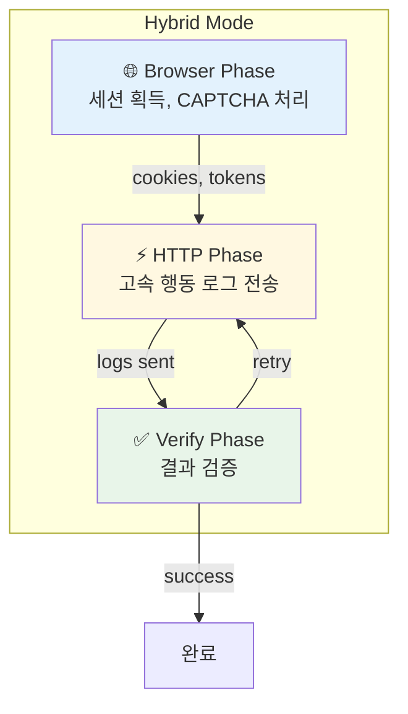

---

## 실행 플로우

### 전체 시퀀스

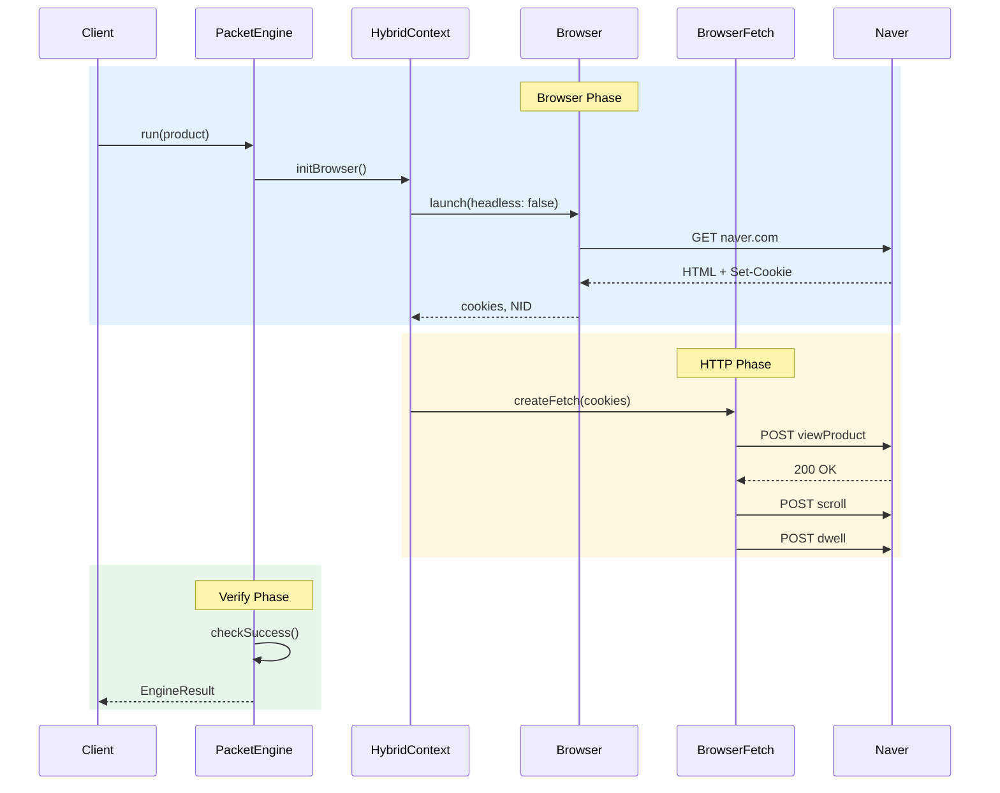

---

## Phase별 상세

### 1. Browser Phase

> 실제 브라우저로 세션 획득

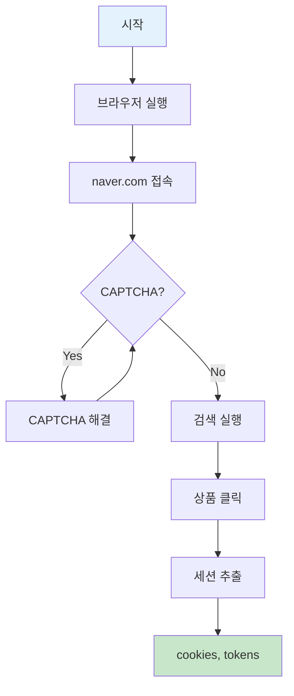

**획득 데이터:**
```typescript
interface SessionData {
  cookies: Cookie[];      // NID, NACT 등
  nacToken: string;       // NAC 인증 토큰
  userAgent: string;      // 브라우저 UA
  deviceId: string;       // 디바이스 ID
  pageUid: string;        // 페이지 UID
}
```

### 2. HTTP Phase

> Chrome TLS로 고속 로그 전송

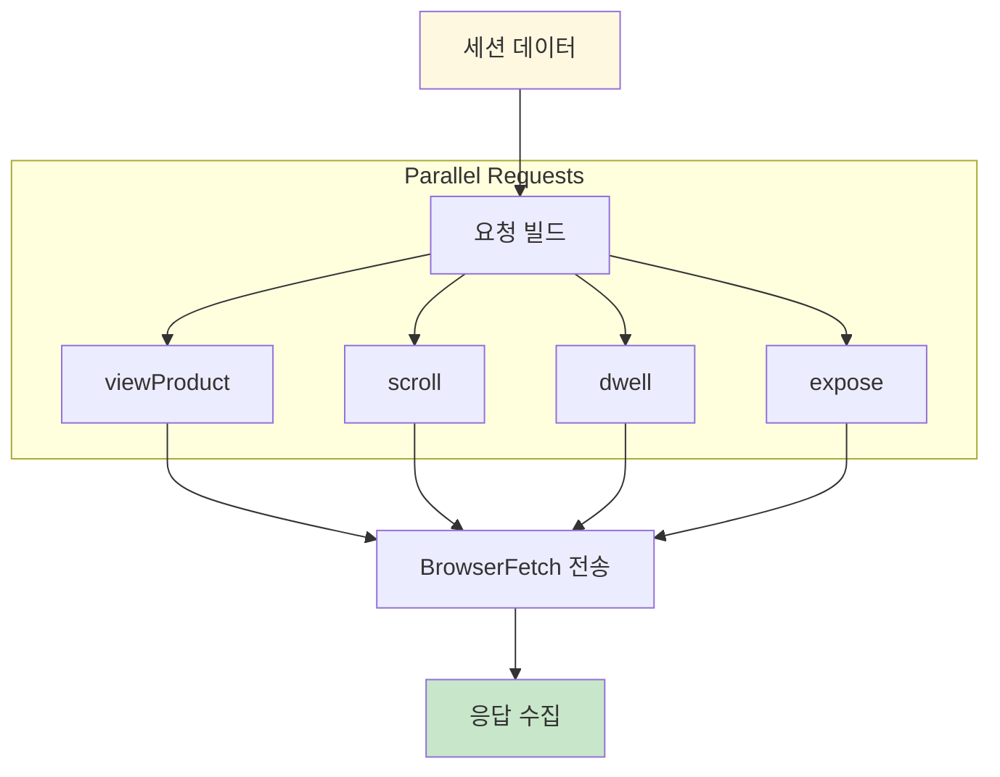

**BrowserFetch 특징:**
```
✅ Chrome TLS fingerprint 유지
✅ HTTP/2 multiplexing
✅ Connection 재사용
✅ 쿠키 자동 전송
```

### 3. Verify Phase

> 성공 여부 검증

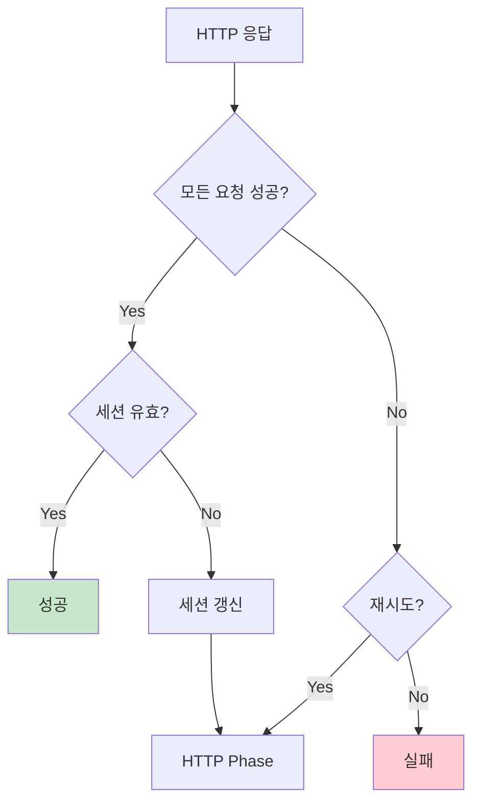

---

## 상태 전이 다이어그램

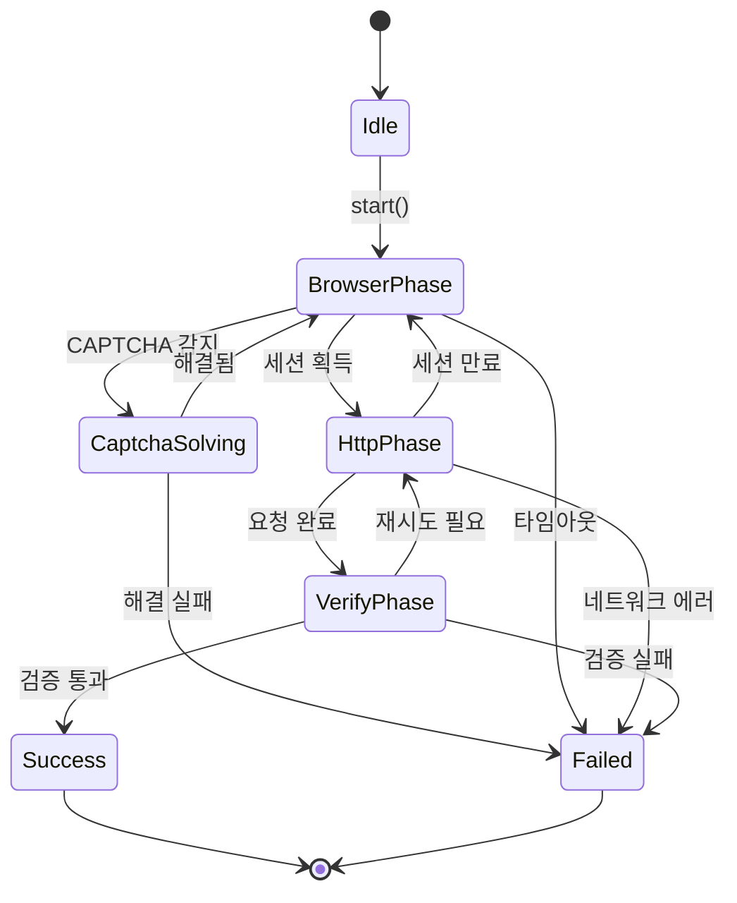

---

## 모드별 비교

### Pure Browser Mode

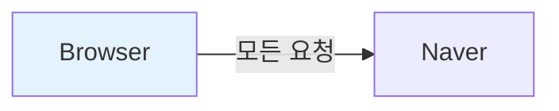

| 장점 | 단점 |
|------|------|
| 완벽한 fingerprint | 느림 |
| CAPTCHA 대응 | 리소스 많이 사용 |
| 안정적 | 병렬화 어려움 |

### Pure HTTP Mode

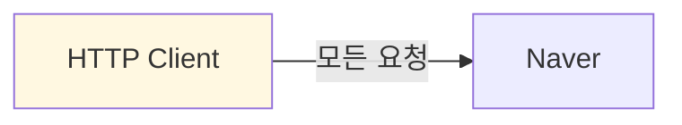

| 장점 | 단점 |
|------|------|
| 빠름 | TLS fingerprint 노출 |
| 병렬화 쉬움 | CAPTCHA 대응 불가 |
| 리소스 적음 | 세션 관리 어려움 |

### Hybrid Mode (권장)

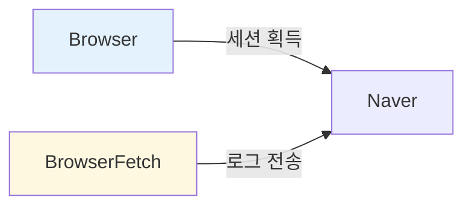

| 장점 | 단점 |
|------|------|
| Chrome TLS 유지 | 구현 복잡 |
| 빠른 로그 전송 | 세션 동기화 필요 |
| CAPTCHA 대응 가능 | 상태 관리 필요 |
| 병렬화 가능 | |

---

## BrowserFetch vs 일반 HTTP

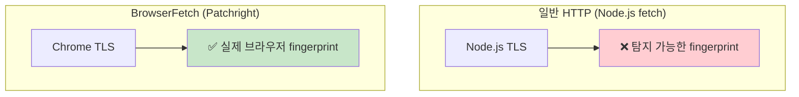

### TLS Fingerprint 비교

| 항목 | Node.js fetch | BrowserFetch |
|------|--------------|--------------|
| JA3 Hash | Node.js 고유값 | Chrome 동일 |
| Cipher Suite 순서 | 다름 | Chrome 동일 |
| Extensions | 다름 | Chrome 동일 |
| ALPN | h2, http/1.1 | Chrome 동일 |
| 탐지 위험 | 🔴 높음 | 🟢 낮음 |

---

## 에러 핸들링

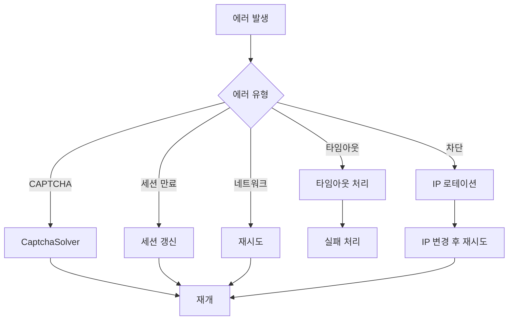

---

## 설정 옵션

```typescript
interface HybridConfig {
  // Browser Phase
  headless: boolean;           // false 권장
  browserTimeout: number;      // 30000ms

  // HTTP Phase
  httpTimeout: number;         // 10000ms
  maxConcurrency: number;      // 6

  // CAPTCHA
  captchaSolverEnabled: boolean;
  maxCaptchaRetries: number;   // 2

  // Retry
  retryCount: number;          // 2
  retryDelay: number;          // 1000ms
}
```

---

## Version History

| 날짜 | 버전 | 변경사항 |
|------|------|---------|
| 2024-12-11 | v1.0 | 초기 문서 작성 |
