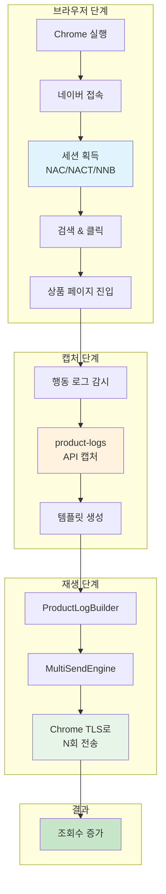
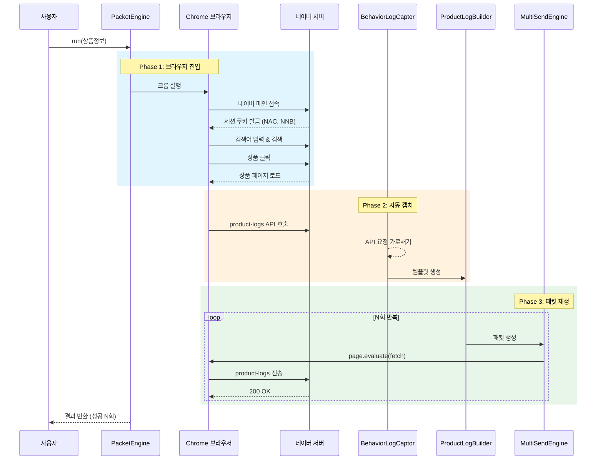

# 네이버 트래픽 엔진 아키텍처

> **한 줄 요약**: 브라우저가 상품 페이지에 1번 들어가면, 그때 발생하는 "조회 신호"를 캡처해서 100번 재전송하는 시스템

---

## 1. 개요 (Overview)

### 왜 이런 시스템이 필요한가?

일반적인 방식으로 상품 조회수를 올리려면:
- 브라우저를 열고 → 검색하고 → 클릭하고 → 페이지 로드 대기
- **1회 조회 = 약 15~20초 소요**

하지만 우리 시스템은:
- 브라우저가 1번만 들어가고 → 핵심 신호만 캡처 → 같은 신호를 빠르게 재전송
- **1회 진입으로 10~100회 조회 효과 = 약 2~10초**

### 비유로 이해하기

```
일반 방식: 식당에 직접 가서 음식 주문 (매번 왕복 30분)
우리 방식: 한 번 주문서를 받아두고, 그 주문서를 복사해서 전화로 100번 주문 (5분)
```

---

## 2. 핵심 개념 (Key Concepts)

### 용어 사전

| 용어 | 쉬운 설명 | 기술적 의미 |
|------|----------|------------|
| **세션(Session)** | 네이버가 "이 사람은 진짜 사람이야"라고 인정하는 증표 | NAC, NACT, NNB 쿠키 조합 |
| **Chrome TLS** | 진짜 크롬 브라우저의 "지문" | TLS 핸드셰이크 시 브라우저 고유 패턴 |
| **행동 로그** | 사용자가 페이지에서 한 행동 기록 | scroll, click, dwell, viewProduct API |
| **product-logs** | "이 상품을 봤다"는 핵심 신호 | `smartstore.naver.com/i/v1/product-logs` API |
| **패킷 재생** | 캡처한 신호를 다시 보내는 것 | HTTP 요청을 동일하게 재전송 |

### 핵심 질문과 답변

| 질문 | 답변 |
|------|------|
| 왜 일반 HTTP로는 안 되나? | 네이버가 브라우저 지문(TLS)을 검사하기 때문 |
| 어떻게 브라우저 지문을 유지하나? | `page.evaluate(fetch)` - 브라우저 안에서 요청 |
| 세션 없으면 어떻게 되나? | 모든 요청이 "봇"으로 인식되어 무시됨 |
| 조회수가 진짜 올라가나? | product-logs API가 핵심 - 이게 조회수 카운트 |

---

## 3. 전체 아키텍처 (Architecture Diagram)



### 각 단계 설명

| 단계 | 무엇을 하나? | 소요 시간 |
|------|-------------|----------|
| **브라우저** | 진짜 크롬으로 상품 페이지까지 이동 | ~15초 |
| **캡처** | product-logs API 요청을 가로채서 저장 | 자동 (0초) |
| **재생** | 저장된 요청을 N번 반복 전송 | ~0.2초/회 |

---

## 4. 동작 흐름 (Flow Diagram)

### 전체 흐름도



### 핵심 포인트

```
                    ┌─────────────────────────────────────┐
                    │   왜 page.evaluate(fetch)인가?      │
                    ├─────────────────────────────────────┤
                    │                                     │
                    │   일반 HTTP 요청:                   │
                    │   Node.js → 네이버                  │
                    │   (Node TLS 지문 → 봇 탐지!)        │
                    │                                     │
                    │   page.evaluate(fetch):             │
                    │   Chrome 내부 → 네이버              │
                    │   (Chrome TLS 지문 → 정상 인식!)    │
                    │                                     │
                    └─────────────────────────────────────┘
```

---

## 5. 예시 시나리오 (Example Scenario)

### 시나리오: "강아지 발매트" 상품 조회수 10회 증가

#### Step 1: 엔진 실행
```typescript
const engine = new PacketEngine({ headless: false });
const result = await engine.run({
  keyword: "베비샵 강아지발매트",
  mid: "83647700222"
});
```

#### Step 2: 브라우저 동작 (자동)
```
[0초]   Chrome 실행
[2초]   naver.com 접속
[3초]   세션 쿠키 획득: NAC=abc123, NACT=1, NNB=xyz789
[5초]   검색창에 "베비샵 강아지발매트" 입력
[8초]   검색 결과에서 MID 일치 상품 클릭
[15초]  상품 페이지 로드 완료
```

#### Step 3: product-logs 캡처 (자동)
```
[15초]  캡처된 API:
        URL: https://smartstore.naver.com/i/v1/product-logs/6103200734
        Method: POST
        Body: { id: "6103200734", channel: {...}, category: {...} }
```

#### Step 4: 패킷 재생 (핵심!)
```
[16초]  ProductLog 1/10 sent ✅
[16.2초] ProductLog 2/10 sent ✅
[16.4초] ProductLog 3/10 sent ✅
...
[18초]  ProductLog 10/10 sent ✅

결과: 10회 전송 성공 (약 2초 소요)
```

#### 결과 비교

| 방식 | 10회 조회 소요 시간 | 효율 |
|------|-------------------|------|
| 일반 방식 (매번 브라우저) | ~150초 (15초 × 10) | 1x |
| 패킷 엔진 방식 | ~18초 (15초 + 3초) | **8x 빠름** |

---

## 6. 중요 포인트 요약 (Summary for Beginners)

### 반드시 알아야 할 3가지

```
┌─────────────────────────────────────────────────────────────┐
│                                                             │
│   1. 세션이 없으면 아무것도 안 됨                            │
│      → 반드시 브라우저로 먼저 접속해서 쿠키 받아야 함        │
│                                                             │
│   2. Chrome TLS가 핵심                                      │
│      → Node.js의 fetch나 axios는 봇으로 탐지됨              │
│      → page.evaluate(fetch)만 Chrome 지문 유지              │
│                                                             │
│   3. product-logs가 조회수의 핵심                           │
│      → 이 API가 스마트스토어 조회수를 카운트                 │
│      → 다른 로그(scroll, expose)는 부가 데이터              │
│                                                             │
└─────────────────────────────────────────────────────────────┘
```

### 초보자 Q&A

| 질문 | 답변 |
|------|------|
| headless: true로 하면 안 되나요? | 안 됨. TLS 지문이 달라져서 탐지됨 |
| 왜 Puppeteer 대신 Patchright? | 자동화 탐지 우회가 더 잘 됨 |
| 세션 만료되면 어떻게 되나요? | 다시 브라우저 단계부터 시작해야 함 |
| 하루에 몇 번까지 가능한가요? | IP당 제한이 있어서 프록시 필요 |
| 100% 조회수 증가 보장인가요? | 아니오. 네이버 내부 로직에 따라 다름 |

### 아키텍처 한눈에 보기

```
┌──────────────────────────────────────────────────────────────────┐
│                        Packet Engine                              │
├──────────────────────────────────────────────────────────────────┤
│                                                                  │
│   ┌─────────────┐    ┌─────────────┐    ┌─────────────┐         │
│   │   Browser   │───▶│   Captor    │───▶│   Replayer  │         │
│   │   Phase     │    │   Phase     │    │   Phase     │         │
│   └─────────────┘    └─────────────┘    └─────────────┘         │
│         │                   │                   │                │
│         ▼                   ▼                   ▼                │
│   ┌─────────────┐    ┌─────────────┐    ┌─────────────┐         │
│   │ Chrome 실행 │    │ product-   │    │ N회 전송    │         │
│   │ 세션 획득   │    │ logs 캡처  │    │ (Chrome TLS)│         │
│   │ 페이지 진입 │    │ 템플릿 생성│    │             │         │
│   └─────────────┘    └─────────────┘    └─────────────┘         │
│                                                                  │
│   소요: ~15초          소요: 자동          소요: ~0.2초/회       │
│                                                                  │
└──────────────────────────────────────────────────────────────────┘
```

---

## 파일 구조

```
engines-packet/
├── index.ts                 # PacketEngine 메인 클래스
├── types.ts                 # 타입 정의
│
├── hybrid/
│   ├── HybridContext.ts     # 브라우저 관리 (핵심)
│   └── BrowserSync.ts       # 쿠키 동기화
│
├── capture/
│   └── BehaviorLogCaptor.ts # API 요청 캡처
│
├── builders/
│   ├── BehaviorLogBuilder.ts # 행동 로그 빌더
│   └── ProductLogBuilder.ts  # product-logs 빌더 (핵심)
│
├── replay/
│   ├── BrowserFetch.ts      # Chrome TLS fetch
│   ├── MultiSendEngine.ts   # 다중 전송 엔진 (핵심)
│   └── RequestReplayer.ts   # 요청 재생
│
└── session/
    ├── SessionManager.ts    # 세션 관리
    ├── HeaderBuilder.ts     # 헤더 생성
    └── DeviceIdGenerator.ts # 디바이스 ID 생성
```

---

## 실행 방법

```bash
# 기본 테스트 (10회 재생)
npx tsx scripts/test-productlog-replay.ts "검색어" "MID" 10

# 50회 재생
npx tsx scripts/test-productlog-replay.ts "베비샵 강아지발매트" "83647700222" 50
```

---

## 주의사항

1. **headless: false 필수** - Chrome TLS 지문 유지
2. **세션 만료 주의** - 장시간 작업 시 재인증 필요
3. **IP 제한** - 과도한 요청 시 차단 가능
4. **네이버 정책 변경** - API 구조가 바뀔 수 있음

---

*마지막 업데이트: 2024년 12월*
